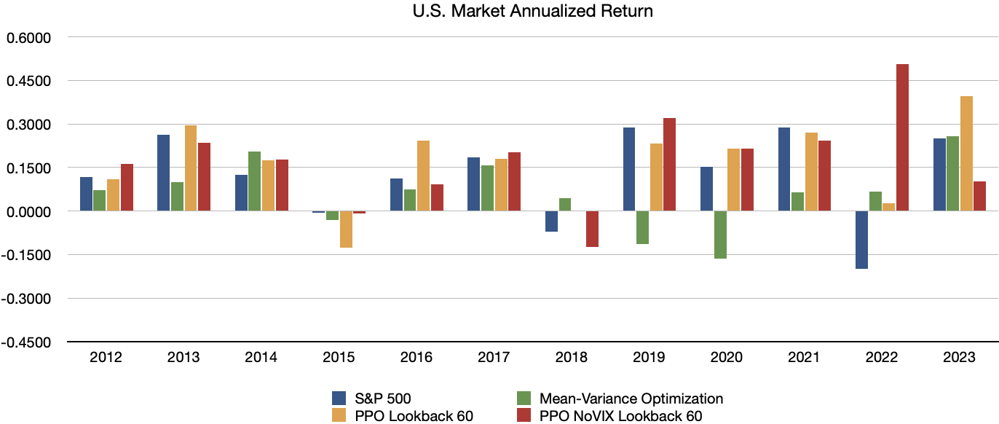
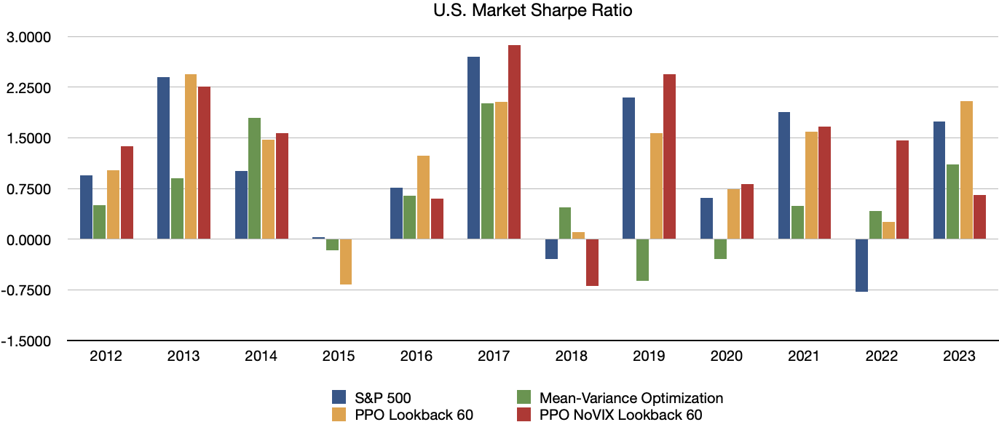
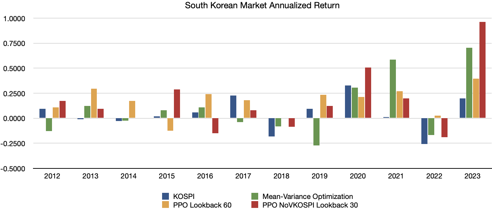
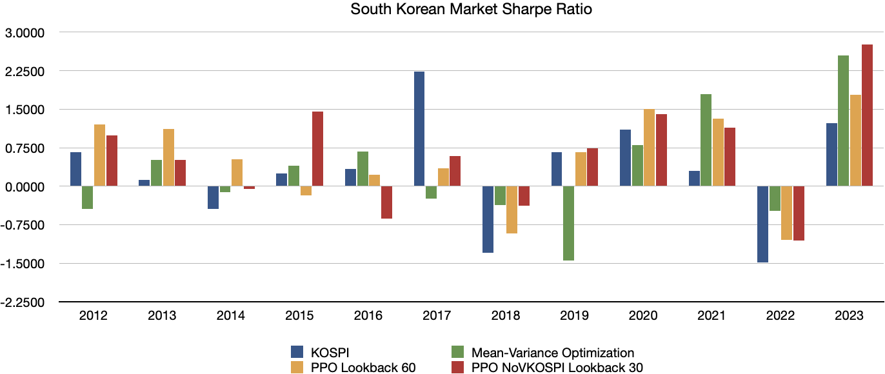

# 포트폴리오 선택을 위한 심층 강화학습 (Portfolio Selection via Deep Reinforcement Learning)

[](https://www.python.org/)
[](https://pytorch.org/)
[](https://stable-baselines3.readthedocs.io/en/master/)
[](https://gymnasium.farama.org/)

박재연의 석사 학위 논문 "Portfolio Selection via Deep Reinforcement Learning: Comparative Analysis with Classical Strategies"의 공식 코드 저장소입니다.

논문 전문은 `/thesis` 폴더에서, 코드는 `/code` 폴더에서 확인하실 수 있습니다.

---

## 📜 개요 (Abstract)

포트폴리오 관리는 위험을 최소화하면서 투자 목표를 달성하기 위해 자산을 전략적으로 배분하는 것을 포함합니다. 본 연구는 포트폴리오 배분 최적화를 위해 전통적인 평균-분산 최적화(MVO), 블랙-리터만 모델, 그리고 심층 강화학습(DRL)을 비교하여 포트폴리오 관리를 탐구합니다. MVO는 공분산 행렬을 추정하기 위해 Ledoit-Wolf 축소 방법을 사용하고 최적화를 위해 효율적 프론티어 기법을 적용합니다. 블랙-리터만 모델은 CAPM에서 파생된 시장 균형 수익률에 투자자의 견해를 통합하여 MVO를 확장하며, 더 균형 잡힌 접근 방식을 제공합니다. 반면, DRL 방법으로는 PPO(Proximal Policy Optimization)가 포트폴리오 가중치를 동적으로 조정하는 데 사용됩니다. 과거 시장 데이터를 사용한 백테스팅 기반의 실증 분석 결과, DRL 접근 방식이 누적 수익률, 연간 수익률, 변동성, 샤프 비율 등 다양한 성과 지표에서 MVO와 블랙-리터만 모델을 모두 크게 능가하는 것으로 나타났습니다. 이러한 결과는 DRL, 특히 PPO 전략이 현대 금융 시장에서 우수한 수익률을 달성하고 위험을 효과적으로 관리할 수 있는 동적이고 적응적인 포트폴리오 관리를 위한 강력한 도구로서의 잠재력을 강조합니다.

## 📚 메인 참고 문헌 (Main Reference)

본 프로젝트는 J.P. Morgan AI Research에서 발표한 다음 논문을 기반으로 합니다.

* Sood, S., Papasotiriou, K., Vaiciulis, M., & Balch, T. (2023). **[Deep reinforcement learning for optimal portfolio allocation: A comparative study with mean-variance optimization](https://icaps23.icaps-conference.org/papers/finplan/FinPlan23_paper_4.pdf)**. *J.P. Morgan AI Research & Proceedings of the 3rd International Workshop on Financial Planning (FinPlan 2023)*.
  
## 📜 개요 (Abstract)

포트폴리오 관리는 위험을 최소화하면서 투자 목표를 달성하기 위해 자산을 전략적으로 배분하는 것을 포함합니다. 본 연구는 포트폴리오 배분 최적화를 위해 전통적인 평균-분산 최적화(MVO), 블랙-리터만 모델, 그리고 심층 강화학습(DRL)을 비교하여 포트폴리오 관리를 탐구합니다. MVO는 공분산 행렬을 추정하기 위해 Ledoit-Wolf 축소 방법을 사용하고 최적화를 위해 효율적 프론티어 기법을 적용합니다. 블랙-리터만 모델은 CAPM에서 파생된 시장 균형 수익률에 투자자의 견해를 통합하여 MVO를 확장하며, 더 균형 잡힌 접근 방식을 제공합니다. 반면, DRL 방법으로는 PPO(Proximal Policy Optimization)가 포트폴리오 가중치를 동적으로 조정하는 데 사용됩니다. 과거 시장 데이터를 사용한 백테스팅 기반의 실증 분석 결과, DRL 접근 방식이 누적 수익률, 연간 수익률, 변동성, 샤프 비율 등 다양한 성과 지표에서 MVO와 블랙-리터만 모델을 모두 크게 능가하는 것으로 나타났습니다.

**본 연구는 S. Sood 등의 J.P. Morgan AI Research 논문 "Deep reinforcement learning for optimal portfolio allocation"을 메인 레퍼런스로 하여, 논문의 방법론을 재현하고 한국 및 미국 시장 데이터에 적용하여 비교 분석하는 것을 목표로 합니다.**

## 📚 메인 참고 문헌 (Main Reference)

본 프로젝트는 J.P. Morgan AI Research에서 발표한 다음 논문을 기반으로 합니다.

* Sood, S., Papasotiriou, K., Vaiciulis, M., & Balch, T. (2023). **[Deep reinforcement learning for optimal portfolio allocation: A comparative study with mean-variance optimization](https://icaps23.icaps-conference.org/papers/finplan/FinPlan23_paper_4.pdf)**. *J.P. Morgan AI Research & Proceedings of the 3rd International Workshop on Financial Planning (FinPlan 2023)*.

---

## 🚀 핵심 결과 (Key Findings)

### 🇺🇸 미국 시장 (U.S. Market)

**전략별 성과 요약 (2012-2023 평균)**

| Metric | PPO Return-LB60 | Mean-Variance (MVO) | Black-Litterman | S&P 500 |
| :--- | :---: | :---: | :---: | :---: |
| **연간 수익률 (Ann. Return)** | **0.1177** | 0.0612 | 0.1496 | 0.1252 |
| **연간 변동성 (Ann. Volatility)** | 0.1595 | 0.1773 | 0.1819 | 0.1539 |
| **샤프 비율 (Sharpe Ratio)** | 0.9733 | 0.6044 | 0.9670 | 1.0912 |
| **최대 낙폭 (Max Drawdown)** | **0.1169** | 0.1379 | 0.1320 | 0.1182 |
| **최종 포트폴리오 가치** | \$326,126.20 | \$194,396.62 | \$498,448.37 | \$373,500.85 |

*($100,000 초기 자본 기준)*

**연간 수익률 (Annualized Return) - U.S. Market**


**샤프 비율 (Sharpe Ratio) - U.S. Market**


### 🇰🇷 한국 시장 (South Korean Market)

**전략별 성과 요약 (2012-2023 평균)**

| Metric | PPO Lookback 60 | Mean-Variance (MVO) | Black-Litterman | KOSPI |
| :--- | :---: | :---: | :---: | :---: |
| **연간 수익률 (Ann. Return)** | **0.1434** | 0.0996 | 0.0583 | 0.0463 |
| **연간 변동성 (Ann. Volatility)** | 0.2151 | 0.2571 | 0.2612 | 0.1483 |
| **샤프 비율 (Sharpe Ratio)** | **0.5456** | 0.3021 | 0.1536 | 0.3072 |
| **최대 낙폭 (Max Drawdown)** | 0.1849 | 0.2261 | 0.2418 | 0.1533 |
| **최종 포트폴리오 가치** | **₩372,696,087** | ₩197,822,628 | ₩122,265,282 | ₩135,827,664 |

*(100,000,000 KRW 초기 자본 기준)*

**연간 수익률 (Annualized Return) - South Korean Market**


**샤프 비율 (Sharpe Ratio) - South Korean Market**


---

## 🛠️ 리포지토리 구조

```
/DRL-Portfolio-Optimization
├── /code
│   ├── train_ppo_return_reward.py  # PPO 에이전트 학습 및 백테스팅 스크립트
│   └── requirements.txt            # 실행에 필요한 Python 라이브러리
│
├── /thesis
│   └── Park_JaeYeon_Masters_Thesis_2024.pdf # 본 프로젝트의 석사 학위 논문
│
├── /results
│   └── (코드를 실행하면 백테스팅 결과 .csv 파일이 이곳에 저장됩니다)
│
├── .gitignore                      # Git이 추적하지 않을 파일 목록
└── README.md                       # 프로젝트 설명 파일
```

## 📈 방법론 (Methodology)

### 1. 모델 (Model)
* **PPO (Proximal Policy Optimization)**: `stable-baselines3` 라이브러리를 사용하여 PPO 에이전트를 학습시킵니다.

### 2. 환경 (Environment)
* **Custom Gym Env**: `gym` 라이브러리를 상속받아 포트폴리오 관리에 특화된 커스텀 환경을 구축했습니다.
* **State (상태)**:
    * `n`개 자산의 과거 `T`일간(e.g., 60일) 수익률
    * `vol20` (20일 롤링 변동성)
    * `vol20/vol60` (단기/장기 변동성 비율)
    * `VIX` (미국 시장) 또는 `VKOSPI` (한국 시장)
* **Action (행동)**:
    * `n-1` 차원의 연속적인 값 (0~1)으로, 각 자산에 대한 포트폴리오 가중치(비중)를 나타냅니다.
    * 마지막 자산(Cash)의 비중은 `1 - (나머지 자산 비중의 합)`으로 자동 계산됩니다.
* **Reward (보상)**:
    * 본 리포지토리의 코드는 논문에서 언급된 실험 중 하나인 **단순 포트폴리오 수익률** (`new_portfolio_value - current_portfolio_value`)을 보상 함수로 사용합니다.

### 3. 학습 및 테스트 (Training & Testing)
* **Sliding Window (슬라이딩 윈도우)**:
    * 금융 데이터의 시계열 특성을 반영하기 위해 롤링 방식으로 학습 및 평가를 진행합니다.
    * **학습 (Train):** 5년 (e.g., 2006-2010)
    * **검증 (Validation):** 1년 (e.g., 2011)
    * **테스트 (Test):** 1년 (e.g., 2012)
    * 이후 윈도우를 1년씩 이동(e.g., 2007-2011 학습 -> 2012 검증 -> 2013 테스트)하며 전체 기간을 백테스팅합니다.
* **데이터:**
    * 미국 시장 (S&P 500 섹터 ETF 9종 + 현금)
    * 한국 시장 (KOSPI 주요 종목 15종 + 현금)

## 🚀 실행 방법 (How to Run)

### 1. 저장소 복제 (Clone Repository)
```bash
git clone [https://github.com/](https://github.com/)[Your_Username]/DRL-Portfolio-Optimization.git
cd DRL-Portfolio-Optimization
```

### 2. 가상 환경 생성 및 활성화
```bash
# 가상 환경 생성 (최초 1회)
python -m venv venv

# 가상 환경 활성화 (Windows)
.\venv\Scripts\activate
# (macOS/Linux)
# source venv/bin/activate
```

### 3. 필요 라이브러리 설치
```bash
pip install -r code/requirements.txt
```

### 4. 스크립트 실행
```bash
# 코드 실행 (미국 시장 데이터로 학습 및 백테스팅 시작)
python code/train_ppo_return_reward.py
```
* 스크립트가 실행되면 `models/` 폴더에 학습된 모델(.zip)이 저장되고, `results/` 폴더에 최종 백테스팅 결과인 `PPO_results_1.csv` 파일이 생성됩니다.

## 🎓 저자 (Author)

* **박재연 (Jae Yeon Park)**
* Portfolio Selection via Deep Reinforcement Learning: Comparative Analysis with Classical Strategies (2024), Department of Mathematical Sciences, UNIST


